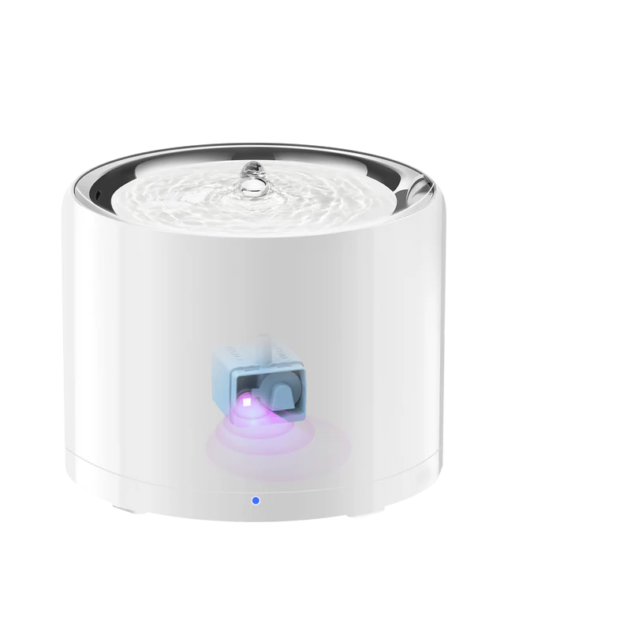

# Petkit W5 Water Fountain

::: info BLE Device
The W5 water fountain communicates via Bluetooth Low Energy (BLE) through a nearby Petkit device acting as a **BLE proxy** (see [Bluetooth Devices Overview](./overview)). The proxy must be present on the network and within Bluetooth range of the fountain. Localkit receives status updates from the fountain and can also send commands to it (power, mode, filter reset).
:::

The Petkit W5 is a smart pet water fountain. Localkit decodes BLE advertisements from the device and exposes its status as Home Assistant entities via MQTT. Supported variants include W5, W5C, W4X, and CTW3.

::: tip Acknowledgement
The BLE protocol implementation is based on the work of [slespersen/PetkitW5BLEMQTT](https://github.com/slespersen/PetkitW5BLEMQTT). Many thanks for reverse engineering the W5 BLE protocol.
:::

## Controls (Writable)

These appear as **Switch**, **Select**, and **Button** entities in Home Assistant under the `config` category. Saving sends the command to the fountain over BLE via the linked proxy.

| Name | Type | Technical Name | Description |
|------|------|----------------|-------------|
| Power | Switch | `power_status` | Turns the fountain on or off |
| Mode | Select | `mode` | Fountain mode: `Normal` or `Smart` |
| Reset Filter | Button | `action_reset_filter` | Resets the filter counter after replacing the filter |
| Refresh Device Data | Button | `action_refresh_data` | Makes the proxy reconnect over BLE and pull a fresh status |

Power and mode can also be changed from the device detail form in the Localkit Web UI. The **Refresh Device Data** and **Reset Filter** actions are available as row actions in the Bluetooth Devices list.

## Binary Sensors (Read-only)

These appear as **Binary Sensor** entities in Home Assistant under the `diagnostic` category.

| Name | Technical Name | Device Class | Description |
|------|---------------|-------------|-------------|
| Running | `running_status` | power | `on` when the pump is actively running |
| Do Not Disturb Active | `dnd_state` | — | `on` while the DND schedule is active |
| Do Not Disturb | `do_not_disturb_switch` | — | `on` when the DND schedule is enabled |
| LED Switch | `led_switch` | — | `on` when the LED is enabled |
| Warning: Breakdown | `warning_breakdown` | problem | `on` when a hardware fault is detected |
| Warning: Water Missing | `warning_water_missing` | problem | `on` when the water level is too low |
| Warning: Filter | `warning_filter` | problem | `on` when the filter needs attention |

## Sensors (Read-only)

These appear as **Sensor** entities in Home Assistant under the `diagnostic` category.

| Name | Technical Name | Unit | Description |
|------|---------------|------|-------------|
| Filter % | `filter_percentage` | % | Remaining filter capacity (0–100) |
| Filter Time Left | `filter_time_left` | d | Estimated days until filter replacement |
| Last Update | `last_update` | — | Timestamp of the last accepted status frame |
| Do Not Disturb Time On | `do_not_disturb_time_on` | — | Start of the quiet period (`HH:MM`) |
| Do Not Disturb Time Off | `do_not_disturb_time_off` | — | End of the quiet period (`HH:MM`) |
| Smart Mode Time On | `smart_time_on` | min | Smart mode on-duration |
| Smart Mode Time Off | `smart_time_off` | min | Smart mode off-duration |
| LED Brightness | `led_brightness` | — | LED brightness level |
| LED Light Time On | `led_light_time_on` | — | LED on-time (`HH:MM`) |
| LED Light Time Off | `led_light_time_off` | — | LED off-time (`HH:MM`) |
| Pump Runtime | `pump_runtime` | — | Total pump runtime (lifetime) |
| Pump Runtime Today | `pump_runtime_today` | — | Pump runtime today |
| Purified Water | `purified_water` | L | Total liters of water purified (lifetime) |
| Purified Water Today | `purified_water_today` | L | Liters purified today |
| Energy Consumption | `energy_consumed` | kWh | Total energy used |
| Link With | `link_with` | — | Name of the Petkit proxy device this fountain is linked to |

## Data Quality

The fountain occasionally sends malformed or truncated status frames. Localkit rejects these instead of parsing them into zeroed values — the last known good state is kept, and the **Last Update** sensor always shows when the last valid frame was received. If the sensor grows stale, check that the linked proxy is online and within Bluetooth range, then use the **Refresh Device Data** button.

## Supported Device Variants

| Alias | Flow Rate | Pump Divisor | Power Draw |
|-------|-----------|-------------|-----------|
| W5 | 1.5 L/min | 2.0 | 0.75 W |
| W5C | 1.3 L/min | 1.0 | 0.182 W |
| W4X | 1.5 L/min | 1.8 | 0.75 W |
| CTW3 | 1.5 L/min | 3.0 | 0.75 W |

The variant affects how pump runtime is translated into purified water volume and energy consumption figures.