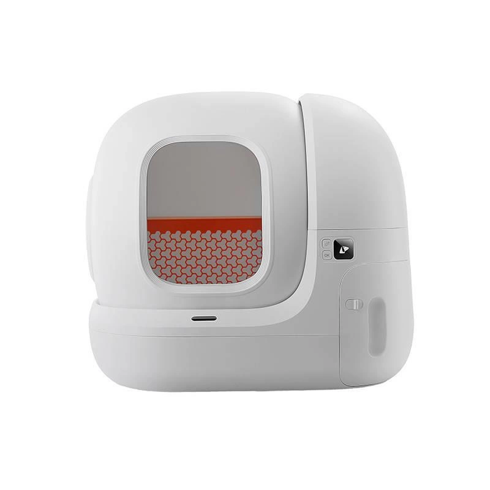

# Petkit Pura Max

::: info ESP32 Device
The Pura Max runs on an ESP32 chip and supports firmware updates over the air (OTA).
:::

The Petkit Pura Max is an automatic self-cleaning litter box. Localkit exposes its full feature set as Home Assistant entities via MQTT.

## Supported Features

- ✅ Auto cleaning cycle
- ✅ Manual cleaning control
- ✅ Maintenance mode
- ✅ K3 odor spray integration
- ✅ Litter monitoring (weight, fill level, usage count)
- ✅ N50 deodorizer filter tracking
- ✅ Do-not-disturb scheduling
- ✅ Kitten protection mode
- ✅ Error reporting
- ✅ Bluetooth Proxy

## Actions (Buttons)

These appear as **Button** entities in Home Assistant.

| Name | Description |
|------|-------------|
| Cleaning Start | Starts a cleaning cycle |
| Dump Litter | Empties the litter drawer |
| Maintenance Start | Enters maintenance mode (drum stays open) |
| Maintenance Stop | Exits maintenance mode |
| Odour Start | Activates the built-in deodorizer |
| Lightning Start | Triggers the K3 spray device |
| Lightning Stop | Stops the K3 spray device |
| Reset N50 | Resets the N50 filter usage counter |

## Sensors (Read-only)

These appear as **Sensor** entities in Home Assistant under the `diagnostic` category.

| Name | Technical Name | Unit | Description |
|------|---------------|------|-------------|
| Device Status | `device_status` | — | Current working state: `IDLE`, `WORKING`, `CLEANING`, `MAINTENANCE`, `PET_IN` |
| Error | `error` | — | Active error message, `null` when no error |
| Litter Weight | `litter_weight` | g | Current weight of litter in grams |
| Litter Percentage | `litter_percent` | % | How full the litter box is (0–100) |
| Used Times | `used_times` | — | Total number of uses since last reset |
| Next N50 Change in Days | `durabilityInDays` | d | Days remaining until the N50 deodorizer filter should be replaced |

## Switches

These appear as **Switch** entities in Home Assistant under the `config` category.

| Name | Technical Name | Default | Description |
|------|---------------|---------|-------------|
| Child Lock | `manual_lock` | Off | Locks the physical buttons on the device |
| Screen Display | `display` | Off | Turns the display/indicator light on or off |
| Auto Cleaning | `auto_work` | On | Automatically starts a cleaning cycle after each use |
| Uninterrupted Rotation | `downpos` | Off | Keeps the drum rotating without stopping mid-cycle |
| Avoid Repeated Cleaning | `avoid_repeat` | On | Prevents a new cleaning cycle from starting too soon after the last one |
| Disable Auto Cleaning for Light Weight | `underweight` | Off | Skips auto cleaning if the detected weight is below the threshold (avoids false triggers) |
| Kitten Protection | `kitten` | Off | Extends the wait time before cleaning to protect kittens that may re-enter the box |
| Do Not Disturb | `disturb_mode` | Off | Suppresses automatic cleaning during the configured quiet hours |
| Deep Cleaning | `deep_clean` | Off | Runs a more thorough cleaning cycle |
| Waste Covering | `bury` | Off | Rotates the drum briefly to cover waste before the full cleaning cycle |

## Select Controls

These appear as **Select** entities in Home Assistant under the `config` category.

| Name | Technical Name | Options | Description |
|------|---------------|---------|-------------|
| Litter Type | `sand_type` | Bentonite/Mineral (1), Tofu (2), Sand (3) | Adjusts sensor thresholds and cleaning behavior based on litter type |
| Unit | `unit` | Kilogram (0), Pound (1) | Weight display unit for the litter weight sensor |
| Language | `language` | English, German, Spanish, Chinese, Italian, Japanese, Portuguese, Turkish, Russian, French | Display language on the device screen |

## Number Controls

These appear as **Number** entities in Home Assistant under the `config` category.

| Name | Technical Name | Range | Step | Default | Description |
|------|---------------|-------|------|---------|-------------|
| N50 Durability | `n50Durability` | 0–90 | 1 | 30 | Expected lifespan of the N50 filter in days. Used to calculate the next change reminder. |

## How to Flash Modified Firmware

1. Open the device detail page in the Localkit Web UI.
2. Start Action **Check OTA**.
3. Reboot the device — Localkit will automatically serve the modified firmware and the device will install it.

The firmware is loaded directly from Localkit, no manual file transfer is needed.

::: warning Flash twice
The ESP32 has a fallback partition. You need to repeat the OTA process twice to ensure the modified firmware is written to both partitions — otherwise the device may boot back into the original firmware after a reboot.
:::

::: info Reverting to stock firmware
Reverting to the original stock firmware is currently not implemented.
:::

## K3 Integration

The Pura Max can be paired with a [Petkit K3](../bluetooth-devices/k3) Bluetooth odor spray device. Once paired, the K3 is triggered automatically after each cleaning cycle. Use the **Lightning Start** and **Lightning Stop** buttons to control the K3 manually, or use **Link with K3** / **Unlink from K3** actions to manage the pairing.

→ [K3 Odor Spray documentation](../bluetooth-devices/k3)
