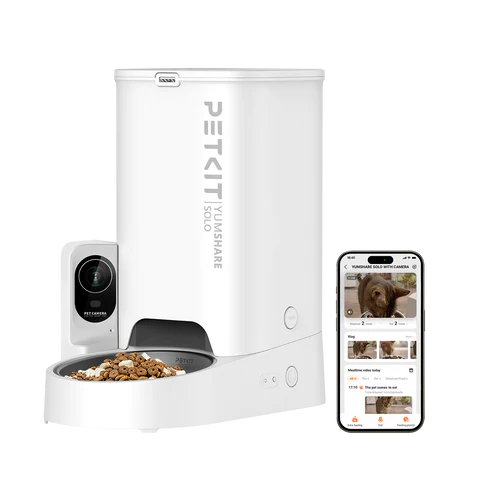
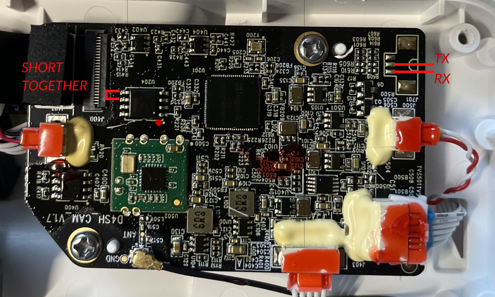

# Petkit Yumshare Solo



::: warning Serial Access Required
The Yumshare Solo runs on an Ingenic embedded Linux platform and does **not** support OTA firmware updates. To enable local control, you need to open the device and gain access via serial connection.
:::

The Petkit Yumshare Solo is an automatic pet feeder with a built-in camera. In addition to scheduled feeding, it provides live video streaming, motion detection, pet detection, and eating detection. Localkit exposes all these features as Home Assistant entities via MQTT.

## Supported Features

- ✅ Manual feed trigger
- ✅ Feeding schedules
- ✅ Camera control (enable/disable)
- ✅ Live stream
- ✅ Snapshot capture
- ✅ Motion detection
- ✅ Pet visit detection
- ✅ Eating detection
- ✅ Night vision
- ✅ Microphone
- ✅ Food level warning
- ✅ Desiccant tracking
- ✅ Volume control
- ✅ Sensitivity tuning
- ✅ Bluetooth Proxy

## Actions (Buttons)

These appear as **Button** entities in Home Assistant.

| Name | Description |
|------|-------------|
| Feed | Dispenses one portion of food immediately |
| Take Snapshot | Captures a photo from the built-in camera |

## Sensors (Read-only)

These appear as **Sensor** entities in Home Assistant under the `diagnostic` category.

| Name | Technical Name | Unit | Description |
|------|---------------|------|-------------|
| Device Status | `device_status` | — | Current working state: `IDLE`, `WORKING` |
| Error | `error` | — | Active error: `food_empty`, `door_closed`, or `null` |
| IP Address | `ip_address` | — | The device's local IP address |
| Bowl | `bowl` | — | Current bowl status as a numeric code |
| Hertz | `hertz` | — | Camera frequency setting (50 or 60 Hz) |
| Next Desiccant Change in Days | `durability_in_days` | d | Days remaining until the desiccant packet should be replaced |

## Binary Sensors (Read-only)

These appear as **Binary Sensor** entities in Home Assistant under the `diagnostic` category.

| Name | Technical Name | Device Class | Description |
|------|---------------|-------------|-------------|
| Move Detected | `move_detected` | motion | `true` when movement is detected in front of the feeder |
| Pet Detected | `pet_detected` | motion | `true` when the camera identifies a pet |
| Eat Detected | `eat_detected` | — | `true` when the camera detects eating behavior |
| Door | `door` | — | `true` when the food tray door is open |
| Infrared | `infrared` | — | `true` when the infrared night vision is active |

## Snapshot

The most recent snapshot taken appears as an **Image** entity in Home Assistant.

| Name | Technical Name | Description |
|------|---------------|-------------|
| Snapshot | `last_snapshot` | The latest image captured from the camera |

## Switches

These appear as **Switch** entities in Home Assistant under the `config` category.

| Name | Technical Name | Default | Description |
|------|---------------|---------|-------------|
| Refill Alarm | `food_warn` | On | Sends a notification when the food hopper is running low |
| Child Lock | `manual_lock` | Off | Locks the physical buttons on the device |
| Camera | `camera` | On | Enables or disables the camera module |
| Microphone | `microphone` | On | Enables or disables the built-in microphone |
| Night Vision | `night` | Off | Switches the camera to infrared night vision mode |
| Timestamp Display | `time_display` | Off | Overlays the current time on the camera image |
| Move Detection | `move_detection` | On | Enables motion-triggered detection and alerts |
| Pet Visit Detection | `pet_detection` | On | Enables AI-based pet recognition |
| Pet Eat Detection | `eat_detection` | On | Enables detection of eating behavior |
| Voice for Food Dispensing | `sound_enable` | On | Plays a voice prompt when food is dispensed |
| Voice Prompt | `system_sound_enable` | On | Enables system voice guidance and status announcements |
| Pet Tracking | `smart_frame` | Off | Automatically frames and follows the pet in the camera view |

## Select Controls

These appear as **Select** entities in Home Assistant under the `config` category.

| Name | Technical Name | Options | Description |
|------|---------------|---------|-------------|
| Feed Amount | `amount` | 10, 15, 20, 25, 30, 35, 40, 45, 50 | Portion size per dispense in grams |

## Number Controls

These appear as **Number** entities in Home Assistant under the `config` category.

| Name | Technical Name | Range | Step | Default | Description |
|------|---------------|-------|------|---------|-------------|
| Volume | `volume` | 0–9 | 1 | 4 | Speaker volume for voice prompts and dispense sounds |
| Move Sensitivity | `move_sensitivity` | 1–9 | 1 | 1 | Sensitivity of the motion detection (1 = least sensitive, 9 = most sensitive) |
| Pet Visit Sensitivity | `pet_sensitivity` | 1–9 | 1 | 3 | Sensitivity of the pet recognition AI |
| Pet Eat Sensitivity | `eat_sensitivity` | 1–9 | 1 | 3 | Sensitivity of the eating detection AI |
| Desiccant Durability | `desiccant_durability` | 0–90 | 1 | 30 | Expected lifespan of the desiccant packet in days. Used to calculate the next change reminder. |

## Feeding Schedules

The feeder supports time-based feeding schedules. Each schedule entry defines a time of day and a portion amount. Schedules are stored in dedicated schedule tables and processed by Localkit to trigger feed actions at the configured times.


## How to Access

::: warning Physical access required
The Yumshare Solo does **not** support OTA firmware updates. You need to open the device and connect via serial (FTDI adapter) to gain access. OTA flashing is currently not implemented for this device.
:::

To access the device:

1. Open the device casing to expose the PCB.
2. Connect an FTDI adapter to the serial pins.
3. Use a terminal to establish a serial connection and gain shell access.

### Soldering


The main PCB is located where the camera is. The back piece of the camera needs to be unscrewed to access the board. The connector is not soldered, and the PCB is coated. You need to scratch the coating off, or remove it with acetone.

After the cable is soldered, Power on the Feeder and wait till you get asked for a password.

Root-Password: `while(&P`

### Change Boot Process

To decloude the device, with a simple script, you only need to use this command:

```shell 
wget -qO- http://tool.localkit.io/scripts/d4h/1.0.0/install | sh
```

it downloads all neccessary files, set it to right directory, and edit the app-run-script.

execute `reboot` afterwards, and you are good to go.

