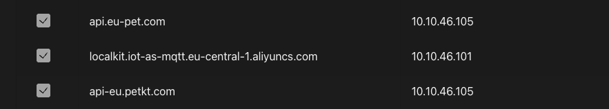

# DNS

### Overview

Localkit intercepts the device's cloud communication by redirecting two domains to the local containers via DNS.

| Domain                | Redirects To | Container |
|-----------------------|---|---|
| `api.eu-pet.com`      | `10.10.46.105` | Localkit |
| `api-eu.petkt.com` | `10.10.46.105` | Localkit |
| `*.iot-as-mqtt.eu-central-1.aliyuncs.com` | `10.10.46.101` | Localkit Broker |

::: info
The region `eu-central-1` may differ depending on your initial device region. Adjust accordingly.
:::

### Device Subdomain

Every device in Localkit needs its own subdomain. Enter the desired subdomain in Localkit and add the corresponding DNS entry pointing to the Localkit Broker IP.

For example: `localkit.iot-as-mqtt.eu-central-1.aliyuncs.com` → `10.10.46.101`

### Initial Setup

When setting up a device for the first time, the device's default cloud MQTT URL must be blocked in your DNS server before flashing the firmware. This forces the device to use the redirected domain from the start.

After the DNS entries are in place and Localkit is running, install the prepared firmware on your devices — this is usually done via OTA update.

### OTA 
That OTA works, you need to add the following DNS entries to your DNS server:
| Domain                | Redirects To | Container |
|-----------------------|---|---|
| `noresolv-localkit-io.iot-as-mqtt.eu-central-1.aliyuncs.com`      | `127.0.0.1` | Localkit |

When Ota is enabled, the connection to MQTT is resolved to localhost, so the HTTP-Fallback is used.
