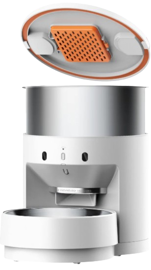

# Supported Devices

Currently, a growing set of Petkit devices is supported. Each device requires a separate implementation.

::: info
ESP32-based devices support firmware updates over the air (OTA). Ingenic/embedded Linux devices require physical serial access to install modified firmware.
:::

## Petkit Pura Max (ESP32)

Automatic self-cleaning litter box with odor control and K3 spray integration.

Supported:
- ✅ Auto and manual cleaning cycles
- ✅ Maintenance mode
- ✅ K3 odor spray (link/unlink, manual trigger)
- ✅ Litter weight, fill level, and usage monitoring
- ✅ N50 deodorizer filter tracking
- ✅ Do-not-disturb scheduling
- ✅ Kitten protection mode
- ✅ Error reporting

[Full documentation →](./devices/pura-max)

---

## Petkit Fresh Element Solo (ESP32)

Automatic pet feeder with portion control and feeding schedules.

Supported:
- ✅ Manual feed trigger
- ✅ Feeding schedules
- ✅ Food level warning
- ✅ Desiccant tracking
- ✅ Feed sound, indicator light, and child lock

[Full documentation →](./devices/fresh-element-solo)

---

## Petkit Fresh Element 3 (ESP32)

::: warning BETA
The integration of this device is currently in beta. Please report any issues you encounter on GitHub.
:::

Automatic pet feeder with portion control and feeding schedules.

Supported:
- ✅ Manual feed trigger
- ✅ Feeding schedules
- ✅ Food level warning
- ✅ Desiccant tracking
- ✅ Child lock
- ✅ Feed sound prompt

[Full documentation →](./devices/fresh-element-3)

---

## Petkit Yumshare Dual (Ingenic / Embedded Linux)

::: warning
No OTA support. To enable local control, you need to open the device and connect via serial.
:::

Automatic dual-hopper pet feeder with a built-in camera, microphone, and AI-based pet and eating detection. Each feeding can mix food from both hoppers independently.

Supported:
- ✅ Manual feed trigger with per-hopper amounts
- ✅ Feeding schedules with per-hopper amounts
- ✅ Per-hopper calibration factors
- ✅ Camera, microphone, night vision
- ✅ Motion, pet visit, and eating detection
- ✅ Volume control
- ✅ Desiccant tracking
- ✅ Pet recognition (discern)
- ✅ Bluetooth Proxy

[Full documentation →](./devices/yumshare-dual)

---

## Petkit Yumshare Solo (Ingenic / Embedded Linux)

::: warning
No OTA support. To enable local control, you need to open the device and connect via serial.
:::

Automatic pet feeder with a built-in camera, motion detection, and AI-based pet and eating detection.

Supported:
- ✅ Manual feed trigger
- ✅ Feeding schedules
- ✅ Camera, microphone, night vision
- ✅ Snapshot capture
- ✅ Motion, pet visit, and eating detection
- ✅ Adjustable detection sensitivity
- ✅ Volume control
- ✅ Desiccant tracking

[Full documentation →](./devices/yumshare-solo)

---

## Petkit Purobot Crystal (Ingenic / Embedded Linux)

::: warning
No OTA support. To enable local control, you need to open the device and connect via serial.
:::

Self-cleaning litter box for crystal litter with a built-in camera, deodorizing spray unit, and health monitoring features (urine pH detection, occult blood detection).

Supported:
- ✅ Automatic and manual cleaning cycles
- ✅ Deodorizing spray (auto, deep, manual)
- ✅ Lightning (UV) cleaning
- ✅ Litter leveling
- ✅ N60 deodorant crystal and cardboard tray tracking
- ✅ Kitten protection mode
- ✅ Camera, snapshots, and pet visit detection
- ✅ Health monitoring (urine pH, occult blood, loose stool recognition)
- ✅ Bluetooth Proxy

[Full documentation →](./devices/purobot-crystal)

---

## Petkit Eversweet Ultra (Ingenic / Embedded Linux)

::: warning
No OTA support. To enable local control, you need to open the device and connect via serial.
:::

Smart water fountain with a built-in camera, automatic water change (drain & refill), heater, clean and waste water tanks, and a replaceable filter cube.

Supported:
- ✅ Fountain flow modes (off, continuous, interval, sensor)
- ✅ Heater with target temperature
- ✅ Automatic drain & refill / drain & flush cycles
- ✅ Deep clean and disinfect cycles
- ✅ Cube (filter) consumable tracking
- ✅ Camera, snapshots, and live stream
- ✅ Pet appearance and drinking detection with pet recognition (discern)
- ✅ Water tank monitoring with alerts
- ✅ Bluetooth Proxy

[Full documentation →](./devices/eversweet-ultra)

---

## Bluetooth Devices

The following BLE devices are supported via a Bluetooth proxy (e.g. a Pura Max or any other WiFi device):

- [Petkit W5](./bluetooth-devices/w5) — smart water fountain, now with full control (power, mode, filter reset)
- [Petkit K3](./bluetooth-devices/k3) — odor spray, linkable to the Pura Max for automatic post-clean triggers

