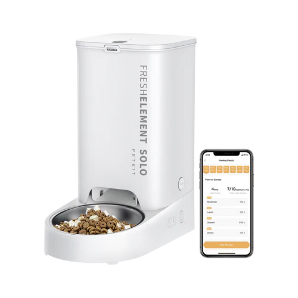

# Supported Devices

Currently, only a limited set of Petkit devices is supported. Each device requires a separate implementation.

::: info
ESP32-based devices support firmware updates over the air (OTA). Ingenic/embedded Linux devices require physical serial access to install modified firmware.
:::

## Petkit Pura Max (ESP32)

Automatic self-cleaning litter box with odor control and K3 spray integration.

Supported:
- ✅ Auto and manual cleaning cycles
- ✅ Maintenance mode
- ✅ K3 odor spray (link/unlink, manual trigger)
- ✅ Litter weight, fill level, and usage monitoring
- ✅ N50 deodorizer filter tracking
- ✅ Do-not-disturb scheduling
- ✅ Kitten protection mode
- ✅ Error reporting

[Full documentation →](./devices/pura-max)

---

## Petkit Fresh Element Solo (ESP32)

Automatic pet feeder with portion control and feeding schedules.

Supported:
- ✅ Manual feed trigger
- ✅ Feeding schedules
- ✅ Food level warning
- ✅ Desiccant tracking
- ✅ Feed sound, indicator light, and child lock

[Full documentation →](./devices/fresh-element-solo)

---

## Petkit Yumshare Solo (Ingenic / Embedded Linux)

::: warning
No OTA support. To enable local control, you need to open the device and connect via serial.
:::

Automatic pet feeder with a built-in camera, motion detection, and AI-based pet and eating detection.

Supported:
- ✅ Manual feed trigger
- ✅ Feeding schedules
- ✅ Camera, microphone, night vision
- ✅ Snapshot capture
- ✅ Motion, pet visit, and eating detection
- ✅ Adjustable detection sensitivity
- ✅ Volume control
- ✅ Desiccant tracking

[Full documentation →](./devices/yumshare-solo)

